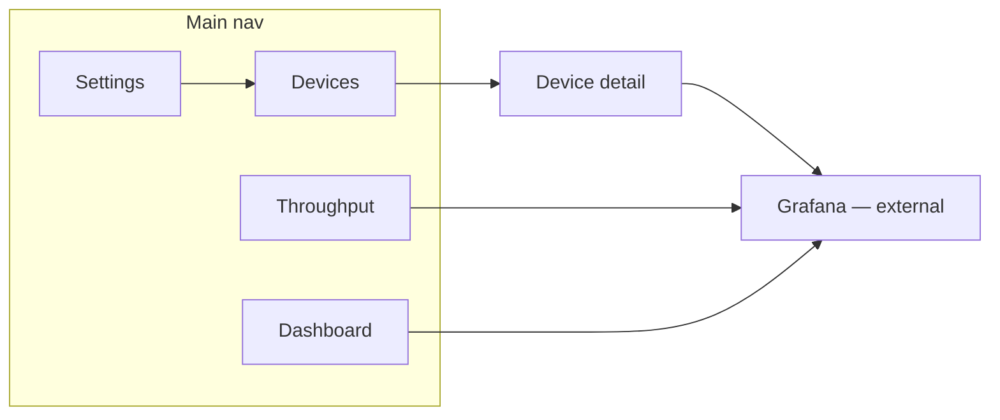

# Pi Gateway — UI Wireframes (v1)

**Host:** PiSensors (`192.168.1.26`) — extends existing web app  
**Backend:** Proxies to gateway API (`GATEWAY_IP:8080`)  
**History:** Links out to Grafana (`.16:3000`) — not embedded in v1  
**Outbound VPN:** [Obscura](https://obscura.com/) (WireGuard on gateway `wg0`)

Low-fidelity mocks for build reference. Align with `PROJECT.md` §8, §11, and §18.

---

## Site map



| Route | Page |
|-------|------|
| `/gateway` | Dashboard |
| `/gateway/settings` | **Global defaults** for new devices |
| `/gateway/devices` | Device list |
| `/gateway/devices/{ip}` | Device detail |
| `/gateway/throughput` | Live throughput |

Grafana opens in a **new tab** with device pre-filtered where possible.

---

## Global shell (every page)

```
┌──────────────────────────────────────────────────────────────────────────────┐
│  ◉ Klasmeier Network Gateway          Gateway ● Online   Obscura ● Connected │
│                                                      Last sync: 12s ago  ⚙   │
├──────────────┬───────────────────────────────────────────────────────────────┤
│              │                                                               │
│  Dashboard   │                    << page content >>                         │
│  Settings    │   ← global defaults for new devices                         │
│  Devices     │                                                               │
│  Throughput  │                                                               │
│              │                                                               │
│  ─────────   │                                                               │
│  Grafana ↗   │   (opens http://192.168.1.16:3000)                           │
│  Pi-hole .11 ↗│  RocPiHole — http://192.168.1.11/admin                      │
│  Pi-hole .4 ↗ │  PiHole-Main — http://192.168.1.4/admin                     │
│              │                                                               │
└──────────────┴───────────────────────────────────────────────────────────────┘
```

**Header status pills**

| Pill | States |
|------|--------|
| **Gateway** | ● Online / ○ Offline / ⚠ Degraded |
| **Obscura** | ● Connected / ○ Down / ○ Kill switch active |
| **dnsmasq** | ● Running / ○ Stopped |

**Footer (optional):** `pivpngateway @ GATEWAY_IP` · API v1 · ui on PiSensors .26

---

## 1. Dashboard

Overview at a glance. Poll `/api/status` and `/api/throughput` every 10–15s.

```
┌──────────────────────────────────────────────────────────────────────────────┐
│  Dashboard                                                                   │
├──────────────────────────────────────────────────────────────────────────────┤
│                                                                              │
│  ┌─────────────────┐  ┌─────────────────┐  ┌─────────────────┐            │
│  │ Obscura tunnel  │  │ Inbound VPN     │  │ DHCP (dnsmasq)  │            │
│  │ ● Connected     │  │ 2 peers online  │  │ ● Running       │            │
│  │ NYC · wg0       │  │ phone, laptop   │  │ 34 active leases│            │
│  │ Handshake 45s   │  │                 │  │ 28 reserved     │            │
│  └─────────────────┘  └─────────────────┘  └─────────────────┘            │
│                                                                              │
│  Throughput (live)                              [ View full throughput → ]  │
│  ┌────────────────────────────────────────────────────────────────────────┐ │
│  │     ▲                                                  ─── LAN total    │ │
│  │     │    ╭──╮     ╭─╮                                  ─── Obscura wg0  │ │
│  │     │   ╭╯  ╰─╮  ╭╯ ╰╮                                                 │ │
│  │     └──────────────────────────────────────────────► time (5 min)      │ │
│  └────────────────────────────────────────────────────────────────────────┘ │
│   ↓ 42 Mbps in   ↑ 8 Mbps out (aggregate)                                   │
│                                                                              │
│  Quick stats                                                                 │
│  ┌──────────────────────┬──────────────────────┬──────────────────────────┐ │
│  │ 2 routed (VPN opt-in)│ 28 bypass (default)  │ 1 Pi-hole opt-in         │ │
│  │ 31 reserved          │ 1 new (unconfigured) │ Defaults: bypass / no π  │ │
│  └──────────────────────┴──────────────────────┴──────────────────────────┘ │
│                                                                              │
│  Recent activity (optional v1.1)                                             │
│  ┌────────────────────────────────────────────────────────────────────────┐ │
│  │ 14:02  MSI .29 switched to bypass                                      │ │
│  │ 13:58  New lease 192.168.1.152 (unknown) — 4h (dynamic)               │ │
│  │ 11:20  Obscura tunnel reconnected                                      │ │
│  └────────────────────────────────────────────────────────────────────────┘ │
│                                                                              │
│  [ Open Grafana dashboards ↗ ]                                               │
└──────────────────────────────────────────────────────────────────────────────┘
```

**Cards pull from**

- `/api/status` — tunnel (`vpn_up`), dnsmasq, uptime, peer count
- `/api/throughput` — sparkline data
- `/api/devices` — counts by `vpn_mode`, reserved vs dynamic

---

## 2. Settings (global defaults)

Controls **network-wide** values and how **new** devices behave before you configure them individually. Existing devices are unchanged unless you edit them on the Devices page.

```
┌──────────────────────────────────────────────────────────────────────────────┐
│  Settings                                                                    │
├──────────────────────────────────────────────────────────────────────────────┤
│                                                                              │
│  Gateway (read-only)                                                         │
│  ┌────────────────────────────────────────────────────────────────────────┐ │
│  │  Gateway IP        GATEWAY_IP        Hostname    pivpngateway          │ │
│  │  Subnet            192.168.1.0/24                                        │ │
│  └────────────────────────────────────────────────────────────────────────┘ │
│                                                                              │
│  New device defaults                                                         │
│  ┌────────────────────────────────────────────────────────────────────────┐ │
│  │  When a device joins the network (unknown MAC or new reservation):     │ │
│  │                                                                        │ │
│  │  VPN (Obscura)     ( ) On — route through Obscura                      │ │
│  │                    (●) Off — direct WAN / home IP   ← initial default  │ │
│  │                                                                        │ │
│  │  Pi-hole DNS       ( ) On — block ads (Pi-hole servers below)          │ │
│  │                    (●) Off — public DNS (servers below)                │ │
│  └────────────────────────────────────────────────────────────────────────┘ │
│                                                                              │
│  DNS & routing                                                               │
│  ┌────────────────────────────────────────────────────────────────────────┐ │
│  │  Public DNS (non–Pi-hole clients)   ≥1 required                       │ │
│  │    Primary     [ 1.1.1.1_______________ ]                              │ │
│  │    Secondary   [ 8.8.8.8_______________ ]  (optional)                 │ │
│  │    ℹ If only one is set, all public-DNS clients use that server only.   │ │
│  │                                                                        │ │
│  │  Pi-hole DNS (opt-in + remote VPN)   ≥1 required                       │ │
│  │    Primary     [ 192.168.1.11__________ ]                              │ │
│  │    Secondary   [ 192.168.1.4___________ ]  (optional)                 │ │
│  │    ℹ If only one is set, all Pi-hole clients use that server only.     │ │
│  │                                                                        │ │
│  │  WAN gateway *  [ 192.168.1.1___________ ]  (R8000 — bypass next-hop)   │ │
│  │    Required. Bypass traffic exits here, not through Obscura.           │ │
│  └────────────────────────────────────────────────────────────────────────┘ │
│                                                                              │
│  DHCP (dnsmasq)                                                              │
│  ┌────────────────────────────────────────────────────────────────────────┐ │
│  │  Dynamic pool      [ 101 ] – [ 254 ]   (.101–.254 unless reserved)     │ │
│  │  Dynamic lease     [ 4 ] hours   (sticky — same MAC keeps IP if free)  │ │
│  │  Reserved lease    [ 24 ] hours  (dhcp-host / fixed reservations)      │ │
│  │                                                                        │ │
│  │                              [ Save settings ]                         │ │
│  └────────────────────────────────────────────────────────────────────────┘ │
│                                                                              │
│  ℹ Save validates: WAN gateway required · ≥1 public DNS · ≥1 Pi-hole DNS    │
│    DHCP/DNS changes regenerate dnsmasq; WAN gateway reloads bypass routing.  │
│                                                                              │
│  At cutover                                                                 │
│  ┌────────────────────────────────────────────────────────────────────────┐ │
│  │  Imported R8000 reservations start as: VPN off · Pi-hole off           │ │
│  │  Opt in device-by-device from the Devices page while testing.          │ │
│  └────────────────────────────────────────────────────────────────────────┘ │
└──────────────────────────────────────────────────────────────────────────────┘
```

**Save errors (examples):**

```
⚠ WAN gateway is required
⚠ At least one public DNS server is required
⚠ At least one Pi-hole DNS server is required
⚠ WAN gateway cannot be the same as the gateway IP
```

GET/PUT `/api/settings` on the gateway. Response includes full `network_defaults` (§8.1). Saving triggers dnsmasq regenerate + `apply-policy-routing.sh` when DNS or `wan_gateway_ip` change.

---

## 3. Devices (list)

Sortable, filterable table. Primary management screen. **At cutover most rows show VPN off / Pi-hole off.**

**DHCP model (see Settings + PROJECT.md §7):** **Rsvd** = fixed IP. **Dyn** = pool with sticky re-assignment. **First seen** / **Last renew** come from the gateway registry and dnsmasq lease file.

```
┌──────────────────────────────────────────────────────────────────────────────┐
│  Devices                                                    [ + Add device ] │
├──────────────────────────────────────────────────────────────────────────────┤
│  🔍 Search hostname, IP, MAC…                                                │
│                                                                              │
│  Filter:  [ All ▾ ]  [ VPN: All ▾ ]  [ DNS: All ▾ ]  [ Type: All ▾ ]   34 devices │
│           All | Reserved | Dynamic only                                      │
│           VPN: Routed | Bypass    DNS: Pi-hole | No Pi-hole (ads)            │
│                                                                              │
│  ┌──────────────────────────────────────────────────────────────────────────┐│
│  │ IP▾ Hostname  MAC        VPN DNS Typ First seen▾  Last renew▾  ↓↑  ···  ││
│  ├──────────────────────────────────────────────────────────────────────────┤│
│  │ .42 Pi5Desktop 2C:CF…   ○  ○  Rsv Jun  1 08:00  Jun 26 07:41  1.2↕  ··· ││
│  │ .20 Christina… 54:6C…   ○  ○  Rsv Jan 15 2024   Jun 26 06:12  0.9↕  ··· ││
│  │ .28 PiFirewall 00:E0…   ○  ○  Rsv Mar  3 2024   Jun 26 07:55  0.1↕  🔒 ││
│  │.152 new-phone  C4:23…   ○  ○  Dyn Jun 26 13:58   Jun 26 13:58  0.5↕  ··· ││
│  │ .59 piAI       88:A2…   ●  ●  Rsv Apr 10 2024   Jun 26 07:30  4.8↕  ··· ││
│  └──────────────────────────────────────────────────────────────────────────┘│
│                                                                              │
│  Dates/times: local timezone · sortable · hover row for full ISO timestamp   │
│  VPN● = Obscura (opt-in)   WAN○ = bypass (default)                           │
│  π● = Pi-hole (opt-in)     π○ = public DNS (default)    🔒 = VPN locked off  │
│  Dyn rows: VPN toggle disabled until **Reserve…** (§10.4 — routed needs fixed IP) │
│  ↓↑ = live rate when metrics available; else — · click row → device detail  │
│                                                                              │
│  Bulk actions (v1.1): [ VPN on ] [ Pi-hole on ] [ Pi-hole off ]             │
└──────────────────────────────────────────────────────────────────────────────┘
```

**Column notes**

| Column | Source | Notes |
|--------|--------|-------|
| **First seen** | Gateway registry | First DHCP request for this MAC (or import date at cutover) |
| **Last renew** | dnsmasq lease file | Last time this MAC was granted/renewed its current lease |
| **Type** | `reserved` flag | Rsvd / Dyn |

Optional v1.1: **Lease expires** column or show only on device detail to keep the table readable.

**Row actions (··· menu)**

- View detail
- **Reserve…** (Dyn only — promote to fixed IP)
- Toggle VPN **on** (opt in)
- Toggle Pi-hole **on** (opt in)
- Open Grafana history ↗
- Copy IP / MAC

**`Reserve…` (from dynamic device) → modal**

```
┌─────────────────────────────────────┐
│  Reserve device                  ✕  │
├─────────────────────────────────────┤
│  Hostname    [ new-phone________ ]  │
│  MAC         C4:23:60:xx:xx:xx      │
│  IP          (●) Keep current .152    │
│              ( ) Choose: [192.168.1.___] │
│  VPN / Pi-hole / Notes — same as Add  │
│                                            │
│  ℹ Device gets chosen IP on next DHCP     │
│    renew (toggle WiFi or reboot).         │
│                                            │
│        [ Cancel ]  [ Save reservation ]    │
└─────────────────────────────────────┘
```

POST `/api/devices` on save → `dhcp-host` + registry; sticky lease becomes fixed.

**`+ Add device` → modal**

```
┌─────────────────────────────────────┐
│  Add reservation                 ✕  │
├─────────────────────────────────────┤
│  Hostname    [________________]     │
│  IP          [192.168.1.___]        │
│  MAC         [__:__:__:__:__:__]     │
│  VPN (Obscura)   ( ) Off — direct WAN  (default) │
│                  ( ) On — Obscura       (opt in) │
│  Pi-hole DNS     ( ) Off — public DNS (default) │
│                  ( ) On — block ads   (opt in) │
│  Notes         [________________]          │
│                                            │
│  ℹ Changing DNS requires device to renew   │
│    its DHCP lease (toggle WiFi / reboot)   │
│                                            │
│        [ Cancel ]  [ Save ]                │
└─────────────────────────────────────┘
```

POST `/api/devices` on save → gateway applies dnsmasq + policy.

---

## 4. Device detail

Single-device view. **Opt in** to VPN and/or Pi-hole when ready.

```
┌──────────────────────────────────────────────────────────────────────────────┐
│  ← Devices    piAI (testing VPN + Pi-hole)                  ● Online (reserved) │
├──────────────────────────────────────────────────────────────────────────────┤
│                                                                              │
│  ┌─ Identity ────────────────┐  ┌─ Policies (home WiFi only — §8.5) ────┐ │
│  │ IP (LAN)      192.168.1.59 │  │  ℹ On home access VPN (remote): always   │ │
│  │ IP (tunnel)   10.66.66.4   │  │    Obscura + Pi-hole — not these toggles │ │
│  │ Hostname      piAI         │  │                                          │ │
│  │ MAC           88:A2:9E:…   │  │  Obscura   (●) On   ( ) Off  [opt-in]  │ │
│  │ DHCP          Reserved     │  │  Pi-hole   (●) On   ( ) Off  [opt-in]  │ │
│  │ Policy        explicit     │  │  Renew DHCP after Pi-hole change         │ │
│  │ Notes         [testing…]   │  └──────────────────────────────────────────┘ │
│  └────────────────────────────┘                                               │
│                                                                              │
│  Live throughput (last 15 min)              [ View history in Grafana ↗ ]   │
│  ┌────────────────────────────────────────────────────────────────────────┐ │
│  │  ↓ Download                                    ↑ Upload                 │ │
│  │  ────╮                                              ╭──                │ │
│  │       ╰────────────────────────────────────────────╯                   │ │
│  └────────────────────────────────────────────────────────────────────────┘ │
│  Current: ↓ 12.4 Mbps   ↑ 1.2 Mbps                                          │
│                                                                              │
│  Session (from lease)                                                        │
│  ┌────────────────────────────────────────────────────────────────────────┐ │
│  │ First seen       Apr 10, 2024 11:02        Last renew   Jun 26 07:30   │ │
│  │ Lease expires    Jun 27 07:30 (22h left)   Gateway      GATEWAY_IP     │ │
│  │ DNS servers      (from Settings — Pi-hole on)                            │ │
│  └────────────────────────────────────────────────────────────────────────┘ │
│                                                                              │
│  ┌─────────────────────────────────────────────────────────────────────────┐│
│  │  ⚠ Remove reservation                              [ Delete device ]  ││
│  └─────────────────────────────────────────────────────────────────────────┘│
└──────────────────────────────────────────────────────────────────────────────┘
```

**Dynamic device detail** (e.g. `new-phone` at `.152` before reserve):

```
│  ← Devices    new-phone (unconfigured)                      ● Online (dynamic) │
│  … policies default to bypass / public DNS …                                   │
│  │ VPN (Obscura)   ( ) Off   ( ) On  — disabled: [ Reserve to enable VPN ]   │
│  │ DHCP          Dynamic (sticky) — pool .101–.254                           │
│  │ First seen     Jun 26, 2024 13:58    Last renew   Jun 26, 2024 13:58      │
│  │ Lease expires  Jun 26, 2024 17:58 (3h 12m)                                  │
│  [ Reserve… ]  [ Dismiss from list ]   ← DELETE /api/devices/{ip} (dynamic)   │
```

**Grafana link example**

`http://192.168.1.16:3000/d/gateway-traffic?var-ip=192.168.1.42`

**Toggle VPN → bypass:** confirm dialog if device is a known special case (PiFirewall, gateway itself).

---

## 5. Throughput

Live network-wide view. History stays in Grafana.

```
┌──────────────────────────────────────────────────────────────────────────────┐
│  Throughput                              [ Open Grafana — full history ↗ ]   │
├──────────────────────────────────────────────────────────────────────────────┤
│  Range: [ 5m ] [ 15m ] [ 1h ]          Auto-refresh: ● 10s                  │
│                                                                              │
│  Gateway interfaces                                                          │
│  ┌────────────────────────────────────────────────────────────────────────┐ │
│  │                    eth0 (LAN)              wg0 (Obscura)                │ │
│  │  ↓ In  ████████████████░░░░  156 Mbps      ↓  98 Mbps                  │ │
│  │  ↑ Out ██████░░░░░░░░░░░░░░   42 Mbps      ↑  38 Mbps                  │ │
│  └────────────────────────────────────────────────────────────────────────┘ │
│                                                                              │
│  Inbound VPN (wg1)                                                           │
│  ┌────────────────────────────────────────────────────────────────────────┐ │
│  │  2 active peers · ↓ 4.2 Mbps · ↑ 0.8 Mbps                              │ │
│  └────────────────────────────────────────────────────────────────────────┘ │
│                                                                              │
│  Top devices (live)                         VPN split                          │
│  ┌──────────────────────────────┐  ┌──────────────────────────────────────┐ │
│  │ 1. piAI        .59   4.8 Mbps│  │      ┌─────────┐                     │ │
│  │ 2. Pi5Desktop  .42   1.2 Mbps│  │      │█████████│ 87% routed          │ │
│  │ 3. unknown     .52   0.5 Mbps│  │      │██       │ 13% bypass          │ │
│  │ 4. piImmich    .63   0.4 Mbps│  │      └─────────┘                     │ │
│  │ 5. MSI         .29   0.3 Mbps│  │                                      │ │
│  │              [ See all → ]   │  │  Bypass: PiFirewall, MSI, …         │ │
│  └──────────────────────────────┘  └──────────────────────────────────────┘ │
│                                                                              │
│  By time of day (teaser — links to Grafana heatmap)                          │
│  ┌────────────────────────────────────────────────────────────────────────┐ │
│  │  Historical heatmaps and weekly trends live in Grafana  [ Open ↗ ]     │ │
│  │  ░░▓▓▓▓▓▓▓▓▓▓▓▓▓▓░░░░  (placeholder illustration only)                 │ │
│  └────────────────────────────────────────────────────────────────────────┘ │
└──────────────────────────────────────────────────────────────────────────────┘
```

---

## 6. Empty / error states

**Gateway unreachable**

```
┌──────────────────────────────────────────────────────────────────────────────┐
│  ⚠ Cannot reach gateway API at GATEWAY_IP:8080                             │
│                                                                              │
│  The home network may still be working — only this admin UI is affected.     │
│  Check: Pi powered? Ethernet link? Kill switch?                              │
│                                                                              │
│  [ Retry ]                                                                   │
└──────────────────────────────────────────────────────────────────────────────┘
```

**Obscura down (kill switch active)**

Kill switch is **always on** for routed devices — not a user setting (§10.5). UI shows status only.

```
┌──────────────────────────────────────────────────────────────────────────────┐
│  Obscura tunnel: ○ DOWN — kill switch active                                 │
│  Routed (VPN opt-in) devices have no internet until the tunnel restores.     │
│  Bypass (default) devices still use direct WAN. Inbound VPN peers may reach   │
│  LAN.                                                                        │
└──────────────────────────────────────────────────────────────────────────────┘
```

---

## Mobile layout (phone on home WiFi)

Collapsible nav → hamburger. Stack cards vertically. Device table → card list.

```
┌─────────────────────────┐
│ ☰  Network Gateway  ●  │
├─────────────────────────┤
│ Obscura    ● Connected  │
│ Inbound    2 peers      │
│ DHCP       ● Running    │
├─────────────────────────┤
│ Throughput (sparkline)  │
│ ↓ 42  ↑ 8 Mbps          │
├─────────────────────────┤
│ Top devices             │
│ piAI .59      4.8 Mbps →│
│ Pi5Desktop    1.2 Mbps →│
│ MSI .29       0.3 Mbps →│
├─────────────────────────┤
│ [ Devices ] [ Throughput]│
└─────────────────────────┘
```

Device detail: VPN toggle as full-width segmented control.

---

## Visual direction (not pixel-perfect)

| Element | Suggestion |
|---------|------------|
| **Tone** | Utilitarian homelab — dark mode default, matches Grafana |
| **Colors** | Green = VPN/routed/healthy · Amber = bypass/warning · Red = down/leak |
| **Typography** | System / sans-serif; monospace for IP/MAC |
| **Charts** | Lightweight (Chart.js or similar); no heavy SPA framework required |
| **Icons** | Simple status dots before pills — avoid clutter |

---

## v1 vs later

| Feature | v1 | Later |
|---------|----|-------|
| Settings | Global defaults, DNS & routing, DHCP pool/leases | |
| Dashboard, devices, detail, throughput | ✓ | |
| VPN opt-in per device | ✓ | Bulk opt-in |
| Pi-hole opt-in per device | ✓ | Bulk opt-in |
| Add / delete reservation | ✓ | Import from router export |
| Reserve dynamic device (sticky → fixed) | ✓ | |
| First seen / last renew on device list | ✓ | Lease expires column |
| Live throughput | ✓ | |
| Grafana links | ✓ | Embedded panels (optional) |
| WireGuard client add/revoke | PiVPN on gateway (manual) | UI/API peer management |
| Activity log | | Audit trail on gateway |
| Auth / login | Basic password on PiSensors (session after login) | SSO / MFA |
| Alerts in UI | | Push from Alertmanager |

---

## Related

- `PROJECT.md` §8.5 — WiFi vs home access VPN (remote always protected)  
- `PROJECT.md` §11 — API and architecture  
- `PROJECT.md` §11.1 — Prometheus/Grafana history  
- `PROJECT.md` §9.2 — PiVPN for inbound WireGuard clients  
- `PROJECT.md` §12.2 — registry backup to RaspiNAS  
